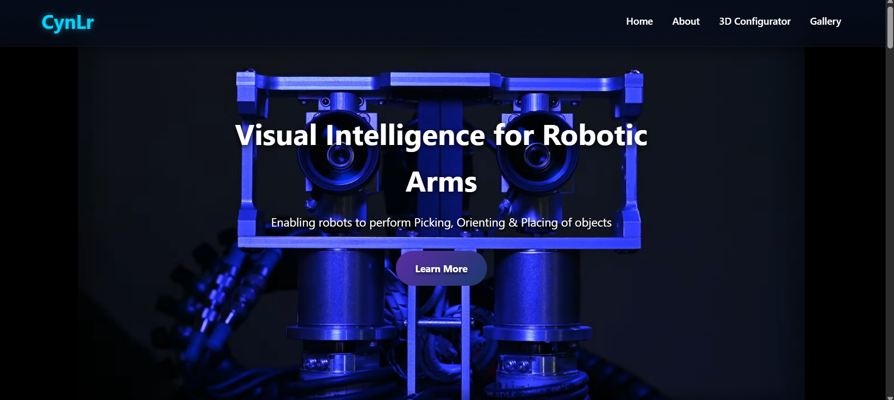
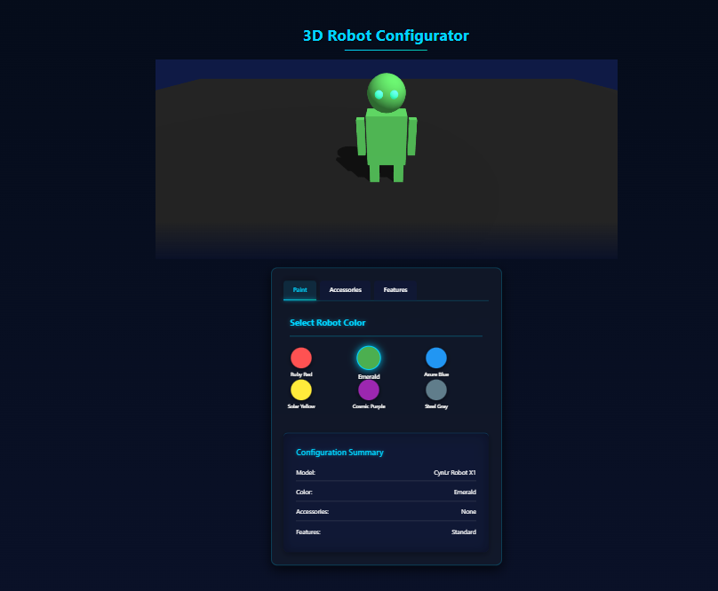
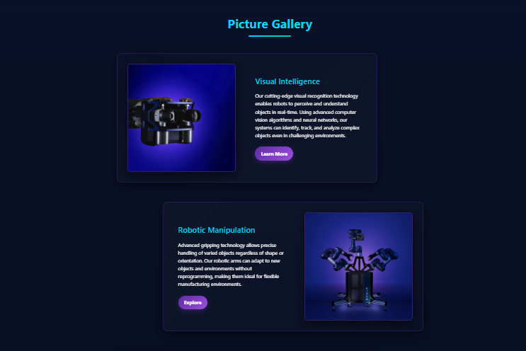

# CynLr - Visual Intelligence for Robotic Arms

<p align="center">
  
</p>

## 🚀 Overview

CynLr's website showcases cutting-edge visual intelligence technology for robotic arms, enabling robots to perform picking, orienting, and placing of objects with unprecedented precision. This modern, interactive website demonstrates the company's innovative approach through immersive web technologies.


## ✨ Key Features

### 🎮 Interactive UI Elements
* Animated buttons with gradient effects and shine animations
* Glass-morphism design elements throughout the interface
* Smooth hover transitions and visual feedback
* Fully responsive design for all devices

<p align="center">
  
</p>

### 🔍 Hover-Over Link Previews
* Smart text links with contextual preview popups
* Multiple content types in previews:
  * Image & text preview for About section
  * Video & text preview for Visual Intelligence
  * GIF & text preview for Object Awareness
  * PDF & text preview for Micro-factories


### 🤖 3D Robot Configurator
* Interactive Three.js powered 3D model visualization
* Real-time color customization with dynamic lighting
* Configurable accessories and features
* Modern glass-effect control panel
* Live configuration summary

<p align="center">
  
</p>

### 🎬 Optimized Video Integration
* YouTube video background with immersive hero section
* Autoplay and loop functionality for continuous display
* Optimized loading and performance


### 🖼️ Modern Gallery
* Vertical scrolling image gallery with reveal animations
* Scroll-triggered content with Intersection Observer API
* Staggered layout with alternating image positioning
* Elegant text and image combinations


## 🎨 Design Elements

### Color Theme
* Deep blue gradients for backgrounds
* Cyan accents for important UI elements
* Purple highlights for interactive components
* Clean white text for optimal readability


### Visual Effects
* Glass-morphism panels with backdrop filters
* Subtle shadows and lighting effects
* Gradient overlays and transitions
* Animated highlights and glows

## 📱 Responsive Design
The website is fully responsive and optimized for:
* Desktop computers (1200px+)
* Tablets (768px - 1199px)
* Mobile devices (< 768px)


## 📂 Project Structure

```
cynlr-website/
├── index.html              # Main landing page
├── about.html              # Company information
├── visual-intelligence.html # Technology explanation
├── object-aware.html       # Feature explanation
├── micro-factories.html    # Vision explanation
├── styles.css              # Main stylesheet
├── script.js               # JavaScript functionality
├── robot_love.glb          # 3D robot model
└── img1.webp, img2.webp... # Gallery images
```

## 🚀 Setup and Usage

1. Clone the repository
```bash
git clone https://github.com/yourusername/cynlr-website.git
```

2. Open the project folder
```bash
cd cynlr-website
```

3. Run a local server (using Node.js http-server or any other method)
```bash
npx http-server
```

4. Open your browser and navigate to `http://localhost:8080`

## 📸 Adding Screenshots

To add the screenshots referenced in this README:

1. Create a `screenshots` folder in the project root
2. Take screenshots of each section of the website
3. Save them with the appropriate names referenced in this document
4. Optimize the images for web to keep the repository size reasonable

## 🔗 Live Demo

[View Live Demo](https://cynlr-project.vercel.app/)


## 📄 License

This project is licensed under the MIT License - see the LICENSE file for details.

## 🙏 Credits

- 3D model: "Robot Love" based on Love, Death and Robots series
- Sample images used with permission
- Built with HTML5, CSS3, JavaScript, and Three.js 
